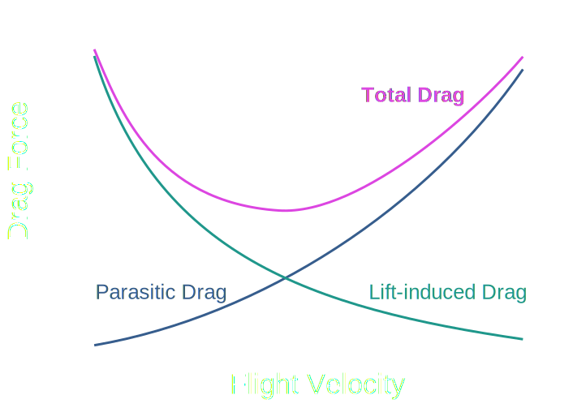



<h1>Drag</h1>

Drag is the force which opposes thrust - caused by the resistance of moving in a fluid

The two main types of drag are:
- Pressure Drag
- Friction Drag

{: .info }
Total Drag = Pressure Drag + Friction Drag

# Skin Friction Drag

This type of Drag is caused by the viscous friction between the surface and the fluid

It is associated with the boundary layer and the amount of drag produced is a product of how much surface area is exposed to the flow

# Pressure Drag

.jpg){:height="100%" width="100%"}

This type of drag is caused by the eddying motions and formations of wake an aerofoil or surface may create

Usually this is greatest for aerofoils at high AoA (Angle of Attack) where seperation between the skin and fluid occurs

{: .note }
For bluff bodies: Pressure Force = Pressure x Area

{:height="150%" width="150%"}

{: .note }
Drag can be calculated for any object travelling through a fluid by using a coefficient for Drag, CD

$$ C_{D} = \frac{Drag Force}{\frac{1}{2}ρu_{m}^2 \times Area} $$

$$ Drag Force = C_{D} \times \frac{1}{2}ρu_{m}^2 \times Area $$