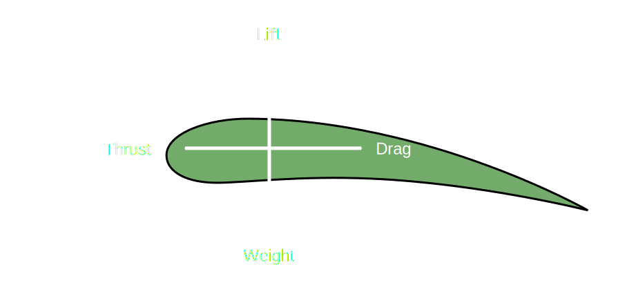



<h1>Fluid Mechanics</h1>

There are 4 primary forces which act on any object which moves through a fluid:
- Lift
- Thrust
- Drag
- Weight (Gravity)

{:height="100%" width="100%"}

{: .note-title }
> In level flight:
>
> On an aircraft, lift balances the force from gravity and is generated mainly by the wing

The shape of the wing is called an aerofoil - these are generally designed to produce lift when moved through a fluid
