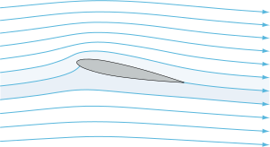



<h1>Streamlines</h1>

{:height="150%" width="150%"}

Streamlines are trajectories of individual fluid elements and they cannot be crossed by fluid elements

Since the curvature on the top is greater (for this AoA) flow speed must be larger on the top surface and slower below it

- The acceletrated flow on the top surface caused by the curvature of the aerofoil and AoA decreases the pressure here

- In turn, the bottom surface will decelerate which increases the pressure

{: .info }
The net of this difference is the <b>Lift Force</b>

[Find out more about lift and aerofoils here](/aerofoil.html)

Unlike the leading edge, streamlines at the trailing edge are essentially parallel

{: .note }
> By definition, streamlines do not cross - except at stagnation points where the flow is at rest
>
> Solid boundaries must be streamlines as no fluid can cross them

# Stagnation Points

Stagnation points are refered to as **critical points*

Streamlines meet and divide at stagnation points, where the fluid velocity is zero

$$ \delta x = U \delta t $$

$$ \delta y = V \delta t $$

$$ \delta z = W \delta t $$

In 2D flow, we can associate each streamline with a property related to mass flux

ψ is the stream function which is constant along a streamline, and the Mass Flux between two stream lines is ~δψ

$$ U = \frac{\delta ψ}{\delta y} $$

$$ V = -\frac{\delta ψ}{\delta x} $$

{: .info }
As streamlines come together, ∂ψ/∂y increases and flow accelerates